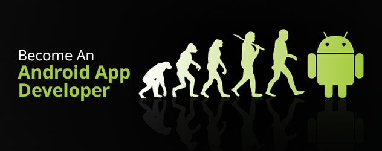
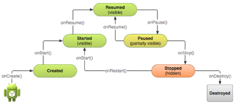

【译】如何成为一个Android开发者
===

> 成为一个Android开发者很容易，但是成为一个好的开发者并不容易。

有一个共同的信念，我们每个人都可以成为Android开发者。这是真的！
但是首先，你必须要熟悉很多的不同语言（编程、标记语言）和概念。
你必须要充分了解你的代码是如何工作的，不要只是随意从网上拷贝一
份代码。

> 我们的博客地址在[这里](http://the-androidguide.blogspot.gr/)

我们进入正题。下面我是你需要学习一些基础知识然后你就有能力构建自己
第一个Android程序了。

* 程序和面向对象的概念
* Java
* XML
* Android 基础的概念(Activities, Activity的生命周期)

在上面的图片你可以看见Activity的生命周期。如果你想写一个合适的、功能
齐全的App。在另一篇文章中，我们详细解释这些例子的概念。

但是，一个好的Android开发者需要熟悉哪些呢？答案有很多！
下面与一份清单:

* JSON
* Networks 
* Databases
* 数据统计
* Graphics
* Api的使用（QQ、微博、支付宝、微信等）
* 会意别人的代码

[原文链接](https://medium.com/@michaeltheofilatos/how-to-be-an-android-developer-15480144b14a#.k5mn7j76l)

